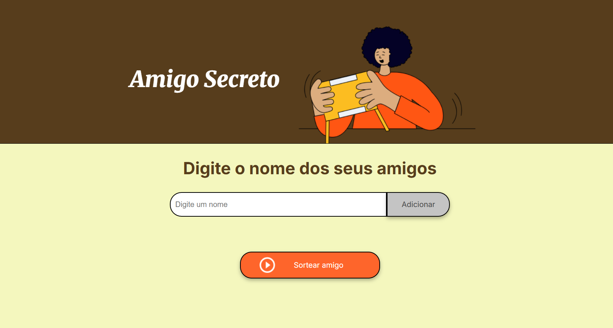

# Challenge do Amigo Secreto

Este é um projeto simples de **Sorteio de Amigo Secreto**, onde você pode adicionar nomes à lista e sortear aleatoriamente um por um, garantindo que um nome não seja sorteado mais de uma vez.

## 🚀 Funcionalidades

✔ Adicionar amigos à lista  
✔ Exibir a lista na tela  
✔ Sortear amigos de forma aleatória  
✔ Garantir que um nome não seja repetido no sorteio  
✔ Exibir os sorteados na tela  

---

## 📸 **Pré-visualização**



---

## 🛠 **Tecnologias Utilizadas**

Este projeto foi desenvolvido com as seguintes tecnologias:

- **HTML** → Estrutura da página  
- **CSS** → Estilização
- **JavaScript** → Manipulação da lista e sorteio  

---

## 📦 **Como Usar**

### 🔹 1. Clonar o repositório  
```bash
git clone https://github.com/anneaiad/challenge-amigo-secreto.git
